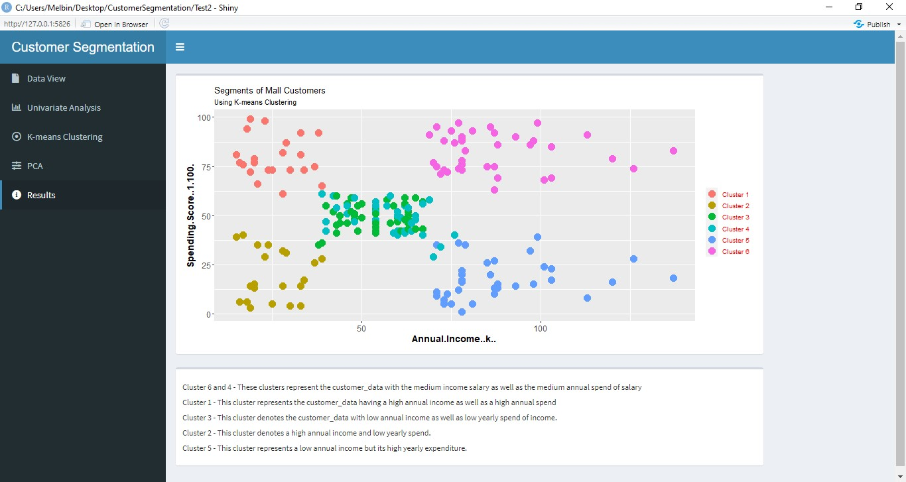

# Customer Segmentation — R Shiny App

An interactive web application for mall customer segmentation using K-means clustering, built with R Shiny and Shinydashboard.



---

## Overview

Customers are central to any business — understanding their behaviour and grouping them by shared traits allows organisations to target the right people with the right message. This project applies **K-means clustering** to mall customer data to segment customers based on their age, annual income, and spending score.

The app provides an end-to-end analysis workflow: from raw data exploration through univariate analysis, cluster number selection, dimensionality reduction (PCA), and final visualisation of the resulting segments.

---

## Features

| Section | What it does |
|---|---|
| **Data View** | Preview the dataset, inspect its structure, summary statistics, and descriptive statistics |
| **Univariate Analysis** | Interactive histogram and box plot for any numeric variable |
| **K-means Clustering** | Elbow method, silhouette analysis, optimal cluster selection (silhouette + gap statistic) |
| **PCA** | Principal Component Analysis summary and loadings for the first two components |
| **Results** | Scatter plot of the final 6-cluster solution with cluster interpretations |

---

## Dataset

The app uses the **Mall Customers** dataset (`Mall_Customers.csv`), which contains:

| Column | Description |
|---|---|
| `CustomerID` | Unique customer identifier |
| `Gender` | Customer gender |
| `Age` | Customer age |
| `Annual Income (k$)` | Annual income in thousands of dollars |
| `Spending Score (1–100)` | Score assigned by the mall based on purchasing behaviour |

Clustering is performed on the last three numeric columns: `Age`, `Annual Income`, and `Spending Score`.

---

## How K-means Clustering Works

K-means partitions *n* observations into *k* clusters by minimising within-cluster variance:

1. Choose the number of clusters *k*.
2. Randomly initialise *k* centroids from the data.
3. Assign each observation to the nearest centroid (Euclidean distance).
4. Recompute each centroid as the mean of its assigned points.
5. Repeat steps 3–4 until assignments no longer change.

This implementation uses `algorithm = "Lloyd"` with `iter.max = 100` and `nstart = 50` (or 100 for the elbow method) to ensure stable results.

### Choosing the Optimal Number of Clusters

Three methods are provided in the app:

- **Elbow Method** — plot total within-cluster sum of squares against *k*; look for the "elbow" where the curve flattens.
- **Silhouette Method** — measures how similar each point is to its own cluster versus neighbouring clusters; higher average silhouette width is better.
- **Gap Statistic** — compares within-cluster dispersion to a null reference distribution; the optimal *k* maximises the gap.

---

## Cluster Interpretation (k = 6)

| Cluster | Income | Spending Score | Profile |
|---|---|---|---|
| 1 | High | High | High-value customers — prime targets for premium products |
| 2 | High | Low | Wealthy but cautious spenders — potential for upselling |
| 3 | Low | Low | Budget-conscious — respond to value deals |
| 4 & 6 | Medium | Medium | Average customers — the largest and most general segment |
| 5 | Low | High | Young, enthusiastic spenders despite lower income |

---

## Technology Stack

| Package | Purpose |
|---|---|
| `shiny` / `shinydashboard` | App framework and dashboard UI |
| `dplyr` / `purrr` | Data manipulation |
| `ggplot2` / `plotly` | Static and interactive visualisation |
| `cluster` / `factoextra` / `NbClust` | Clustering algorithms and diagnostics |
| `psych` | Descriptive statistics |
| `DT` | Interactive data tables |
| `shinyjs` / `shinycssloaders` | UI enhancements |

---

## Getting Started

### Prerequisites

Install R (≥ 4.0) and the following packages:

```r
install.packages(c(
  "shiny", "shinydashboard", "shinyjs", "shinycssloaders",
  "dplyr", "purrr", "ggplot2", "plotly", "DT",
  "psych", "plotrix", "cluster", "factoextra",
  "NbClust", "gridExtra", "evaluate"
))
```

### Running the App

1. Clone this repository:
   ```bash
   git clone https://github.com/your-username/customer-segmentation.git
   cd customer-segmentation
   ```

2. Place `Mall_Customers.csv` in the project root directory.

3. Open `app.R` (or `server.R` / `ui.R`) in RStudio and click **Run App**, or run from the console:
   ```r
   shiny::runApp()
   ```

---

## Project Structure

```
customer-segmentation/
├── ui.R                  # Dashboard UI definition
├── server.R              # Server logic and reactive outputs
├── app.R                 # Combined app entry point (if using single-file format)
├── Mall_Customers.csv    # Dataset
└── README.md
```

---

## Acknowledgements

- Dataset sourced from [Kaggle — Mall Customer Segmentation Data](https://www.kaggle.com/datasets/vjchoudhary7/customer-segmentation-tutorial-in-python)
- K-means implementation via base R `stats::kmeans`
- Cluster visualisation powered by `factoextra`
